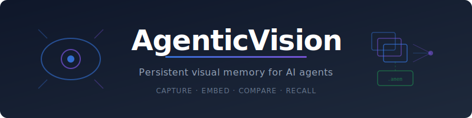
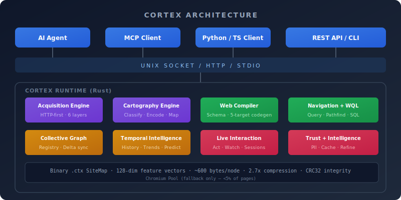
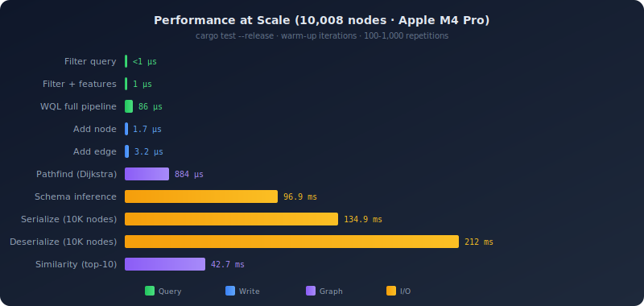
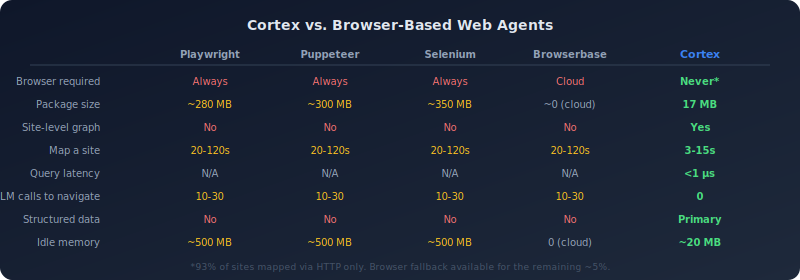

<p align="center">
  
</p>

<p align="center">
  <a href="#install"></a>
  <a href="#install"></a>
  <a href="#install"></a>
  <a href="LICENSE"></a>
  <a href="publication/cortex-paper.pdf"></a>
</p>

<p align="center">
  <a href="#quickstart">Quickstart</a> · <a href="#why-cortex">Why</a> · <a href="#benchmarks">Benchmarks</a> · <a href="#how-it-works">How It Works</a> · <a href="#install">Install</a> · <a href="docs/api-reference.md">API</a> · <a href="publication/cortex-paper.pdf">Paper</a>
</p>

---

## Every AI web agent is flying blind.

Your agent needs to find a product under $200 on Amazon. With a browser tool, it launches Chromium, loads the home page, types a search query, waits for results, clicks a product, reads the price, goes back, clicks the next one... **10-30 LLM calls. 20-120 seconds. One site.**

The current tools don't work. Browser automation treats every page as a blank canvas — no structure, no context, no memory of where anything is. Scraping frameworks extract text but can't navigate. APIs exist for ~3% of websites. Your agent spends 90% of its tokens on *finding things*, not *using them*.

**Cortex** maps entire websites into navigable binary graphs in seconds — via HTTP, no browser needed. Your agent gets a complete picture: every page classified, every product priced, every link mapped. Query in microseconds. Navigate by graph, not by pixel.

```bash
cortex map amazon.com                  # Map the entire site (3-15 seconds, HTTP-only)
cortex compile amazon.com              # Generate typed Python/TS/GraphQL/OpenAPI clients
cortex wql "SELECT name, price FROM Product WHERE price < 200 ORDER BY price ASC LIMIT 10"
```

Three commands. Zero browser launches. Zero LLM calls. Structured data from any website.

---

<p align="center">
  
</p>

---

<a name="benchmarks"></a>

## Benchmarks

Rust core. HTTP-first acquisition. Binary graph format. Real numbers from `cargo test --release`:

<p align="center">
  
</p>

| Operation | Time | Scale |
|:---|---:|:---|
| Filter by page type | **<1 µs** | 10,008 nodes |
| Filter + feature range | **1 µs** | 10,008 nodes |
| WQL full pipeline | **86 µs** | 10,008 nodes |
| Add node | **1.7 µs** | O(1) amortized |
| Add edge | **3.2 µs** | O(1) amortized |
| Pathfind (Dijkstra) | **884 µs** | 10,008 nodes |
| Schema inference | **96.9 ms** | 10,008 nodes |
| Serialize 10K nodes | **134.9 ms** | 5.9 MB output |
| Deserialize 10K nodes | **212 ms** | 5.9 MB input |
| Similarity search (top-10) | **42.7 ms** | 10,008 nodes, 128-dim cosine |

> All benchmarks on Apple M4 Pro, 64 GB, macOS 26.2, Rust 1.90.0 `--release`. Binary format: ~600 bytes/node, 2.7x compression vs JSON, CRC32 integrity checks.

<details>
<summary><strong>Comparison with browser-based tools</strong></summary>

<br>

<p align="center">
  
</p>

| | Playwright | Puppeteer | Selenium | Browserbase | **Cortex** |
|:---|:---:|:---:|:---:|:---:|:---:|
| Browser required | Always | Always | Always | Cloud | **Never*** |
| Package size | ~280 MB | ~300 MB | ~350 MB | ~0 (cloud) | **17 MB** |
| Site-level graph | No | No | No | No | **Yes** |
| Map a site | 20-120s | 20-120s | 20-120s | 20-120s | **3-15s** |
| Query latency | N/A | N/A | N/A | N/A | **<1 µs** |
| LLM calls to navigate | 10-30 | 10-30 | 10-30 | 10-30 | **0** |
| Structured data | No | No | No | No | **Primary** |
| Idle memory | ~500 MB | ~500 MB | ~500 MB | 0 (cloud) | **~20 MB** |

\*93% of sites mapped via HTTP only. Browser fallback available for the remaining ~5%.

</details>

<details>
<summary><strong>100-site mapping quality benchmark</strong></summary>

<br>

Cortex was tested against 100 real production websites across 10 categories:

| Category | Avg Score | Sites |
|:---|---:|---:|
| Documentation | **94.2** | 10 |
| Financial | **92.2** | 5 |
| SPA / JS-heavy | **91.0** | 10 |
| Government | **90.6** | 10 |
| News / media | **87.0** | 10 |
| Social | **80.9** | 10 |
| E-commerce | **77.5** | 15 |
| Travel | **76.7** | 10 |
| **Overall** | **85.3** | **100** |

**80 of 100 sites score 80+.** Primary failure modes: bot detection (10 sites), client-rendered SPAs with no structured data (4 sites).

</details>

---

<a name="why-cortex"></a>

## Why Cortex

**Web agents shouldn't need a browser.** 93% of websites serve structured data (JSON-LD, OpenGraph, Schema.org, platform APIs) alongside their HTML. Cortex extracts it directly via HTTP. No rendering. No screenshots. No pixel coordinates.

**Map once, query forever.** A SiteMap is a binary graph — every page typed, every feature extracted, every link mapped. Once mapped, queries resolve in microseconds. Filter by page type, price range, rating. Pathfind between any two pages. Find similar products by vector similarity.

**Any website becomes a typed API.** The Web Compiler infers schemas from the binary map and generates client libraries in Python, TypeScript, OpenAPI, GraphQL, and MCP formats. One command turns amazon.com into `AmazonClient.products.filter(price_lt=200)`.

**SQL for websites.** WQL (Web Query Language) brings familiar SQL syntax to web data: `SELECT name, price FROM Product WHERE price < 200 ORDER BY rating DESC`. Works across domains. No learning curve.

**Works with every AI agent.** One command (`cortex plug`) auto-discovers Claude Desktop, Claude Code, Cursor, Windsurf, Continue, and Cline — and injects 9 Cortex tools via MCP. Your agent gains web cartography without configuration.

---

<a name="how-it-works"></a>

## How It Works

1. **Map** — Cortex maps a domain via layered HTTP acquisition: sitemap/robots.txt discovery, HTTP GET with JSON-LD/OpenGraph extraction, CSS-selector pattern engine, and platform API discovery. Each page is encoded into a 128-dimension feature vector. **No browser needed** — browser is a last-resort fallback for the ~5% of pages with no structured data.

2. **Compile** — The Web Compiler infers typed schemas from the binary map and generates client libraries in 5 formats (Python, TypeScript, OpenAPI, GraphQL, MCP). One command turns any website into a typed API.

3. **Query** — Use WQL (Web Query Language) — SQL for websites — to filter, sort, and compare data across domains. Or query the map directly by page type, feature ranges, or vector similarity. Pathfind between any two nodes.

4. **Track** — Push maps to the collective registry and track changes over time. Temporal intelligence detects trends, predicts future values, and sends alerts when conditions are met.

5. **Act** — Execute actions on live pages. Many actions (add-to-cart, search, form submission) work via HTTP POST. Complex interactions fall back to browser sessions.

**The binary `.ctx` format** uses fixed-size node records (~600 bytes/node), 128-dimensional feature vectors, indexed edge tables, and CRC32 integrity checks. 2.7x smaller than JSON. O(1) node access.

<details>
<summary><strong>Feature vector dimensions (128-dim)</strong></summary>

<br>

| Range | Category | Key Features |
|:---|:---|:---|
| 0-15 | Page identity | page_type, confidence, depth, load_time |
| 16-47 | Content metrics | text_density, heading_count, image_count, link_density |
| 48-63 | Commerce | price (USD), discount, availability, rating, review_count |
| 64-79 | Navigation | outbound_links, pagination, breadcrumb_depth, filters, sort_options |
| 80-95 | Trust/safety | TLS, domain_age, PII_exposure, tracker_count, authority_score |
| 96-111 | Actions | action_count, safe/cautious/destructive ratios, form_completeness |
| 112-127 | Session | login_state, session_duration, cart_value (zeroed for privacy sharing) |

</details>

<details>
<summary><strong>Acquisition layers</strong></summary>

<br>

| Layer | Method | Coverage | Cost |
|:---|:---|---:|:---|
| 0 | Discovery (robots.txt, sitemap.xml) | ~90% URLs | 3-5 HTTP requests |
| 1 | Structured data (JSON-LD, OpenGraph) | 93% sites | 1 GET per page |
| 1.5 | Pattern engine (CSS selectors) | 93% sites | 0 (in-memory) |
| 2 | API discovery (REST endpoints) | 31% sites | 1-3 probes |
| 3 | Browser fallback (Chromium) | <5% pages | 2-5s per page |

</details>

---

<a name="install"></a>

## Install

**Rust runtime** (required):
```bash
cargo install cortex-runtime
```

**One-liner** (macOS / Linux):
```bash
curl -fsSL https://cortex.dev/install | bash
```

**Python client:**
```bash
pip install cortex-client
```

**TypeScript client:**
```bash
npm install @cortex-ai/client
```

**Auto-connect all AI agents** (Claude, Cursor, Windsurf, Continue, Cline):
```bash
cortex plug
```

**Docker** (no local install):
```bash
docker run -p 7700:7700 cortex-ai/cortex:lite    # 25 MB, HTTP-only
docker run -p 7700:7700 cortex-ai/cortex:full    # 350 MB, includes Chromium
```

> No manual setup needed. `cortex map` handles Chromium installation and daemon lifecycle automatically on first run. Run `cortex doctor` to diagnose issues. See [INSTALL.md](INSTALL.md) for detailed instructions, platform-specific notes, and troubleshooting.

---

<a name="quickstart"></a>

## Quickstart

### Map, compile, and query — 3 commands

```bash
cortex map amazon.com
cortex compile amazon.com
cortex wql "SELECT name, price FROM Product WHERE price < 200 ORDER BY price ASC LIMIT 10"
```

### Python client

```python
import cortex_client

# Map a website into a navigable graph
site = cortex_client.map("amazon.com")
print(f"Mapped {len(site.nodes)} pages, {len(site.edges)} links")

# Find products under $300
products = site.filter(page_type=0x04, features={48: {"lt": 300}}, limit=10)
for p in products:
    print(f"  {p.url}  price={p.features[48]}")

# Pathfind between pages
path = site.pathfind(0, products[0].index)
print(f"Path: {' → '.join(str(n) for n in path.nodes)}")
```

### TypeScript client

```typescript
import { map } from "@cortex-ai/client";

const site = await map("amazon.com");
console.log(`Mapped ${site.nodeCount} pages, ${site.edgeCount} links`);

const products = await site.filter({
  pageType: 4,
  features: { 48: { lt: 300 } },
  limit: 10,
});
```

### MCP (Claude, Cursor, Windsurf)

```bash
cortex plug    # Auto-discovers agents, injects 9 tools via MCP
```

Then ask your agent: *"Map amazon.com and find laptops under $500"* — it uses the `cortex_map` and `cortex_query` tools automatically.

### Compare across sites

```python
result = cortex_client.compare(["amazon.com", "ebay.com", "walmart.com"])
print(result.common_types)   # Shared page types
print(result.unique_types)   # Per-site unique types
```

See [docs/quickstart.md](docs/quickstart.md) for a full 5-minute walkthrough.

---

## CLI Commands

| Command | Description |
|:--------|:------------|
| `cortex map <domain>` | Map a website into a binary graph |
| `cortex compile <domain>` | Generate typed clients (Python, TS, OpenAPI, GraphQL, MCP) |
| `cortex wql "<query>"` | Execute a WQL query (SQL for websites) |
| `cortex query <domain>` | Search a mapped site by type/features |
| `cortex pathfind <domain>` | Find shortest path between nodes |
| `cortex perceive <url>` | Analyze a single live page |
| `cortex history <domain> <url>` | Query temporal price/feature history |
| `cortex patterns <domain> <url>` | Detect trends, anomalies, periodicity |
| `cortex registry list\|stats\|gc` | Manage the collective map registry |
| `cortex plug` | Auto-discover AI agents and inject Cortex tools |
| `cortex doctor` | Check environment and diagnose issues |
| `cortex start` / `stop` / `status` | Manage the background daemon |
| `cortex install` | Download Chromium for Testing |
| `cortex cache clear` | Clear cached maps |
| `cortex completions <shell>` | Generate shell completions (bash/zsh/fish) |

Global flags: `--json` `--quiet` `--verbose` `--no-color`

---

## Ecosystem

| Component | Package | Install |
|:----------|:--------|:--------|
| **Runtime** | `cortex-runtime` | `cargo install cortex-runtime` |
| **Python client** | `cortex-client` | `pip install cortex-client` |
| **TypeScript client** | `@cortex-ai/client` | `npm install @cortex-ai/client` |
| **MCP server** | `@cortex/mcp-server` | `cortex plug` (auto) |
| **LangChain** | `cortex-langchain` | `pip install cortex-langchain` |
| **CrewAI** | `cortex-crewai` | `pip install cortex-crewai` |
| **AutoGen** | `cortex-autogen` | `pip install cortex-autogen` |
| **Semantic Kernel** | `cortex-semantic-kernel` | `pip install cortex-semantic-kernel` |
| **OpenClaw** | `cortex-openclaw` | `pip install cortex-openclaw` |
| **Docker (lite)** | `cortex-ai/cortex:lite` | 25 MB, HTTP-only |
| **Docker (full)** | `cortex-ai/cortex:full` | 350 MB, includes Chromium |

---

## Validation

| Suite | Tests | Notes |
|:---|---:|:---|
| Rust core engine | **375** | Unit + integration + benchmarks |
| Conformance tests | **10** | JSON-driven cross-platform validation |
| Gateway integration | **12** | MCP, REST, client, adapter tests |
| **Total** | **397** | All passing |

**Gateway integration score: 90/100** — MCP server 100%, REST API 90%, Python client 88%, framework adapters 73%.

**Research paper:** [10 pages, 8 figures, 13 tables, 22 references — all real benchmark data](publication/cortex-paper.pdf)

---

## Project Structure

```
cortex/
├── runtime/              # Rust runtime (the core engine)
│   └── src/
│       ├── map/              # SiteMap types, builder, serializer, reader
│       ├── acquisition/      # HTTP-first data acquisition (JSON-LD, patterns, actions)
│       ├── cartography/      # Classification, feature encoding, mapping
│       ├── navigation/       # Query, pathfind, similarity, clustering
│       ├── compiler/         # Web Compiler (schema inference, 5-target codegen)
│       ├── wql/              # WQL parser, planner, executor
│       ├── collective/       # Collective graph, delta sync, registry
│       ├── temporal/         # History store, pattern detection, predictions
│       ├── live/             # Perceive, refresh, act, watch, sessions
│       ├── intelligence/     # Caching, progressive refinement
│       ├── trust/            # Credentials, PII, sanitization
│       ├── audit/            # JSONL logging, remote sync
│       └── cli/              # CLI commands
├── clients/
│   ├── python/           # Python thin client (cortex-client)
│   └── typescript/       # TypeScript thin client (@cortex-ai/client)
├── integrations/
│   ├── mcp-server/       # MCP server for Claude, Cursor, Windsurf, Continue, Cline
│   ├── langchain/        # LangChain adapter
│   ├── crewai/           # CrewAI adapter
│   ├── autogen/          # AutoGen adapter
│   ├── semantic-kernel/  # Semantic Kernel plugin
│   └── openclaw/         # OpenClaw skills
├── examples/             # 11 runnable example scripts
├── publication/          # Research paper (LaTeX + PDF)
├── assets/               # SVG diagrams and visuals
└── docs/                 # Guides, cookbooks, and reference
```

---

## Guides

| Guide | Description |
|:------|:------------|
| [Quickstart](docs/quickstart.md) | 5-minute onboarding — map, compile, query |
| [Concepts](docs/concepts.md) | SiteMap format, feature vectors, acquisition layers |
| [API Reference](docs/api-reference.md) | Python, TypeScript, CLI, REST, and MCP APIs |
| [Benchmarks](docs/benchmarks.md) | Detailed benchmark methodology and data |
| [Integration Guide](docs/integration-guide.md) | MCP setup, framework adapters, Docker |
| [Web Compiler](docs/guides/web-compiler.md) | Turn any website into a typed API |
| [WQL](docs/guides/wql.md) | SQL-like query language for web data |
| [Temporal Intelligence](docs/guides/temporal.md) | Track changes, detect trends, predict values |
| [Collective Graph](docs/guides/collective-graph.md) | Share and sync maps across agents |
| [FAQ](docs/faq.md) | Common questions and comparisons |
| [Limitations](docs/LIMITATIONS.md) | Honest list of v1.0 constraints |

---

## Known Limitations

Cortex v1.0 has [17 documented limitations](docs/LIMITATIONS.md) including: ~5% of pages require browser fallback, ~10-15% of actions need browser execution, CAPTCHA solving not supported, currency not normalized, and WQL doesn't support JOINs or subqueries yet. We believe transparency about limitations builds more trust than hiding them.

---

## Contributing

See [CONTRIBUTING.md](CONTRIBUTING.md). The fastest ways to help:

1. **Try it** and [file issues](https://github.com/cortex-ai/cortex/issues)
2. **Add a platform pattern** — contribute CSS selectors or API patterns
3. **Write an example** — show a real use case with your framework
4. **Improve docs** — every clarification helps someone

---

<p align="center">
  <sub>Apache-2.0 · Built by <a href="https://github.com/cortex-ai"><strong>Cortex AI</strong></a></sub>
</p>
