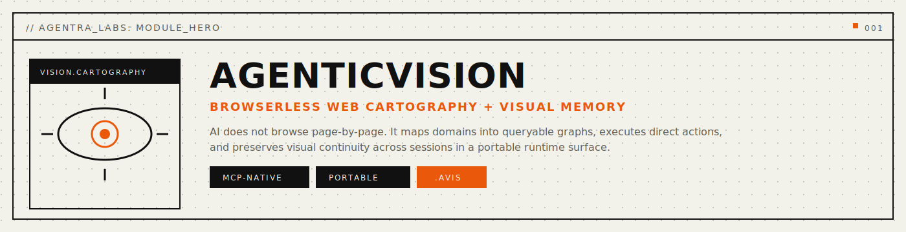
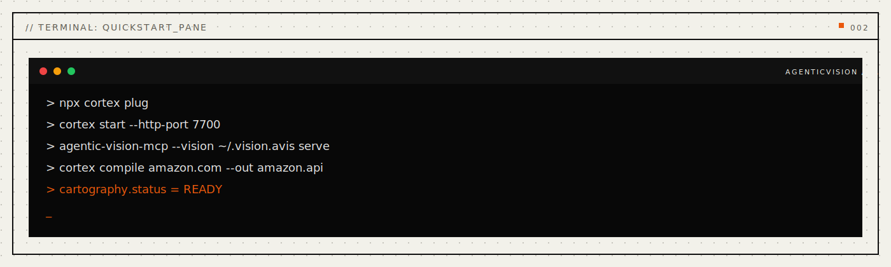

<p align="center">
  
</p>

<p align="center">
  <a href="https://crates.io/crates/agentic-vision"></a>
  <a href="https://crates.io/crates/agentic-vision-mcp"></a>
  <a href="LICENSE"></a>
  <a href="publication/paper-ii-agentic-vision-mcp/agentic-vision-mcp-paper.pdf"></a>
</p>

<p align="center">
  <a href="#quickstart">Quickstart</a> · <a href="#why-agenticvision">Why</a> · <a href="#benchmarks">Benchmarks</a> · <a href="#how-it-works">How It Works</a> · <a href="#install">Install</a> · <a href="INSTALL.md">Full Install Guide</a> · <a href="publication/paper-ii-agentic-vision-mcp/agentic-vision-mcp-paper.pdf">Paper</a>
</p>

---

## AI agents can't see across sessions.

Your agent takes a screenshot, analyzes it, and forgets. Next session — blank slate. It can't compare what a page looks like now versus yesterday. It can't recall what the error dialog said three conversations ago. It can't search its own visual history.

Text-based memory exists. Visual memory doesn't — until now.

**AgenticVision** gives AI agents persistent visual memory. Capture images, embed them with CLIP ViT-B/32, store them in a compact binary format, and query them by similarity, time, or description. Every capture is a first-class MCP resource that any LLM can access.

```bash
cargo install agentic-vision-mcp
```

One binary. 10 MCP tools. Persistent `.avis` files. Works with Claude Desktop, VS Code, Cursor, Windsurf, and any MCP-compatible client.

<p align="center">
  
</p>

---

<a name="benchmarks"></a>

## Benchmarks

Rust core. CLIP ViT-B/32 via ONNX Runtime. Binary `.avis` format. Real numbers from `cargo test --release`:

| Operation | Time | Notes |
|:---|---:|:---|
| Image capture (file → embed → store) | **47 ms** | CLIP ViT-B/32, 512-dim |
| Similarity search (top-5) | **1-2 ms** | Brute-force cosine, f64 precision |
| Visual diff (pixel-level) | **<1 ms** | 8×8 grid region detection |
| MCP tool round-trip | **7.2 ms** | Including process startup (~6.1 ms) |
| Storage per capture | **~4.26 KB** | Embedding + JPEG thumbnail |
| Capacity per GB | **~250K** | Observations |

> All benchmarks on Apple M4, macOS 26.2, Rust 1.90.0 `--release`. ONNX Runtime for CLIP inference. Fallback mode available when ONNX model is not present.

<p align="center">
  
</p>

---

<a name="why-agenticvision"></a>

## Why AgenticVision

**Agents need visual continuity.** A debugging agent should remember what the UI looked like before and after a code change. A monitoring agent should detect visual regressions. A research agent should build a visual knowledge base over time.

**Capture once, query forever.** Every image is embedded into a 512-dimensional CLIP vector and stored with its JPEG thumbnail, timestamp, and description. Query by cosine similarity, time range, or text search — in milliseconds.

**Binary format, not a database.** The `.avis` file is a single portable binary — 64-byte header, JSON payload, JPEG thumbnails. Copy it, share it, back it up. No server, no database, no dependencies.

**Works with every MCP client.** AgenticVision-MCP exposes 10 tools, 6 resources, and 4 prompts via the Model Context Protocol. Any LLM that speaks MCP gains visual memory automatically.

**Links to AgenticMemory.** The `vision_link` tool connects visual captures to [AgenticMemory](https://github.com/agentralabs/agentic-memory) cognitive graph nodes — bridging what an agent *sees* with what it *knows*.

---

<a name="how-it-works"></a>

## How It Works

<p align="center">
  
</p>

1. **Capture** — `vision_capture` accepts images from files, base64, screenshots, or the system clipboard. Each image is resized, embedded via CLIP ViT-B/32 into a 512-dimensional vector, compressed to JPEG thumbnail, and stored in the `.avis` binary file. Screenshots support optional region capture; clipboard reads the current image from the OS clipboard.

2. **Query** — `vision_query` retrieves captures by time range, description, or recency. `vision_similar` finds visually similar captures by cosine similarity. Results include capture metadata, thumbnails, and similarity scores.

3. **Compare** — `vision_compare` places two captures side-by-side for LLM analysis. `vision_diff` performs pixel-level differencing with 8×8 grid region detection to identify exactly what changed.

4. **Link** — `vision_link` connects captures to AgenticMemory nodes, bridging visual observations with the agent's cognitive graph. An agent can recall "what did the UI look like when I made that decision?"

**The `.avis` binary format** uses a 64-byte fixed header (magic `0x41564953`, version, counts, timestamps) followed by a JSON payload containing captures with embedded JPEG thumbnails and 512-dim float vectors. Single-file, portable, no external dependencies.

<details>
<summary><strong>MCP surface area</strong></summary>

<br>

**10 Tools:**

| Tool | Description |
|:---|:---|
| `vision_capture` | Capture and embed an image (file, base64, screenshot, clipboard) |
| `vision_compare` | Side-by-side comparison of two captures |
| `vision_query` | Query captures by time, description, recency |
| `vision_ocr` | Extract text from a captured image |
| `vision_similar` | Find visually similar captures (cosine similarity) |
| `vision_track` | Track visual changes to a target over time |
| `vision_diff` | Pixel-level diff between two captures |
| `vision_link` | Link a capture to an AgenticMemory node |
| `session_start` | Begin a named observation session |
| `session_end` | End the current session |

**6 Resources:**

| URI | Description |
|:---|:---|
| `avis://capture/{id}` | Single capture with metadata and thumbnail |
| `avis://session/{id}` | All captures in a session |
| `avis://timeline/{start}/{end}` | Captures within a time range |
| `avis://similar/{id}` | Visually similar captures |
| `avis://stats` | Storage statistics and counts |
| `avis://recent` | Most recent captures |

**4 Prompts:**

| Prompt | Description |
|:---|:---|
| `observe` | Guided visual observation workflow |
| `compare` | Structured comparison between captures |
| `track` | Change tracking over time |
| `describe` | Detailed image description |

</details>

---

<a name="install"></a>

## Install

**One-liner** (desktop profile, backwards-compatible):
```bash
curl -fsSL https://agentralabs.tech/install/vision | bash
```

**Environment profiles** (one command per environment):
```bash
# Desktop MCP clients (auto-merge Claude Desktop + Claude Code when detected)
curl -fsSL https://agentralabs.tech/install/vision/desktop | bash

# Terminal-only (no desktop config writes)
curl -fsSL https://agentralabs.tech/install/vision/terminal | bash

# Remote/server hosts (no desktop config writes)
curl -fsSL https://agentralabs.tech/install/vision/server | bash
```

| Channel | Command | Result |
|:---|:---|:---|
| GitHub installer (official) | `curl -fsSL https://agentralabs.tech/install/vision \| bash` | Installs release binaries when available, otherwise source fallback; merges MCP config |
| GitHub installer (desktop profile) | `curl -fsSL https://agentralabs.tech/install/vision/desktop \| bash` | Explicit desktop profile behavior |
| GitHub installer (terminal profile) | `curl -fsSL https://agentralabs.tech/install/vision/terminal \| bash` | Installs binaries only; no desktop config writes |
| GitHub installer (server profile) | `curl -fsSL https://agentralabs.tech/install/vision/server \| bash` | Installs binaries only; server-safe behavior |
| crates.io + Cargo deps (official) | `cargo install agentic-vision-mcp` + `cargo add agentic-vision` | Installs MCP server binary and adds the core library crate to your project |

<p align="center">
  
</p>

**MCP Server** (for Claude Desktop, VS Code, Cursor, Windsurf):
```bash
cargo install agentic-vision-mcp
```

**Core library** (for Rust projects):
```bash
cargo add agentic-vision
```

**Configure Claude Desktop** (`~/Library/Application Support/Claude/claude_desktop_config.json`):
```json
{
  "mcpServers": {
    "vision": {
      "command": "agentic-vision-mcp",
      "args": ["--vision", "~/.vision.avis", "serve"]
    }
  }
}
```

> See [INSTALL.md](INSTALL.md) for full installation guide, VS Code / Cursor configuration, build from source, and troubleshooting.

> **Do not use `/tmp` for vision files** — macOS and Linux clear this directory periodically. Use `~/.vision.avis` for persistent storage.

## Deployment Model

- **Standalone by default:** AgenticVision is independently installable and operable. Integration with AgenticMemory or AgenticCodebase is optional, never required.
- **Autonomic operations by default:** daemon/runtime maintenance uses safe profile-based defaults with cache hygiene, migration safeguards, and health-ledger snapshots.

| Area | Default behavior | Controls |
|:---|:---|:---|
| Autonomic profile | Conservative local-first posture | `CORTEX_AUTONOMIC_PROFILE=desktop|cloud|aggressive` |
| Cache + registry maintenance | Periodic expiry cleanup and registry GC | `CORTEX_MAINTENANCE_TICK_SECS`, `CORTEX_REGISTRY_GC_EVERY_TICKS`, `CORTEX_REGISTRY_GC_KEEP_DELTAS` |
| Storage migration | Policy-gated with checkpointed auto-safe path | `CORTEX_STORAGE_MIGRATION_POLICY=auto-safe|strict|off` |
| Maintenance throttling | SLA-aware under sustained cache pressure | `CORTEX_SLA_MAX_CACHE_ENTRIES_BEFORE_GC_THROTTLE` |
| Health ledger | Periodic operational snapshots (default: `~/.agentra/health-ledger`) | `CORTEX_HEALTH_LEDGER_DIR`, `AGENTRA_HEALTH_LEDGER_DIR`, `CORTEX_HEALTH_LEDGER_EMIT_SECS` |

---

<a name="quickstart"></a>

## Quickstart

### MCP (Claude Desktop, VS Code, Cursor)

After configuring the MCP server (see [Install](#install)), ask your agent:

> "Take a screenshot and remember it."

The LLM calls `vision_capture` automatically. Then later:

> "What did the screen look like earlier?"

The LLM calls `vision_query` to retrieve and display past captures.

### Rust API

```rust
use agentic_vision::{VisionStore, CaptureSource};

let mut store = VisionStore::open("observations.avis")?;

// Capture from file
let id = store.capture(
    CaptureSource::File("screenshot.png"),
    "Homepage after deploy"
)?;

// Find similar
let matches = store.similar(id, 5)?;
for m in matches {
    println!("  {} (similarity: {:.3})", m.description, m.score);
}
```

---

## Validation

| Suite | Tests | Notes |
|:---|---:|:---|
| Rust core (`agentic-vision`) | **38** | Unit + integration (includes screenshot/clipboard) |
| Python SDK tests | **47** | Edge cases, format validation |
| MCP integration suite | **3** | Python → Rust stdio transport |
| Multi-agent suite | **3** | Shared file, vision-memory linking, rapid handoff |
| **Total** | **91** | All passing |

**Two research papers:**
- [Paper I: Cortex — Web Cartography (10 pages, 8 figures, 13 tables)](publication/paper-i-cortex/cortex-paper.pdf)
- [Paper II: AgenticVision-MCP — Persistent Visual Memory via MCP (8 pages, 4 figures, 7 tables)](publication/paper-ii-agentic-vision-mcp/agentic-vision-mcp-paper.pdf)

---

## Repository Structure

This is a Cargo workspace monorepo containing the core library and MCP server.

```
agentic-vision/
├── Cargo.toml                    # Workspace root
├── crates/
│   ├── agentic-vision/           # Core library (crates.io: agentic-vision v0.1.0)
│   └── agentic-vision-mcp/       # MCP server (crates.io: agentic-vision-mcp v0.1.0)
├── tests/                        # Integration tests (Python → Rust, multi-agent)
├── models/                       # ONNX model directory (CLIP ViT-B/32)
├── publication/                  # Research papers (I, II)
├── assets/                       # SVG diagrams and visuals
└── docs/                         # Guides and reference
```

### Running Tests

```bash
# All workspace tests (unit + integration)
cargo test --workspace

# Core library only
cargo test -p agentic-vision

# MCP server only
cargo test -p agentic-vision-mcp

# Python integration tests
python tests/integration/test_mcp_clients.py
python tests/integration/test_multi_agent.py
```

### MCP Server Quick Start

```bash
cargo install agentic-vision-mcp
```

Configure Claude Desktop (`~/Library/Application Support/Claude/claude_desktop_config.json`):

```json
{
  "mcpServers": {
    "vision": {
      "command": "agentic-vision-mcp",
      "args": ["--vision", "~/.vision.avis", "serve"]
    }
  }
}
```

`agentic-vision-mcp` supports both line-delimited JSON-RPC and `Content-Length` framed MCP stdio messages.

---

## Roadmap: v0.2.0 — Remote Server Support

The next release adds HTTP/SSE transport for remote deployments. Track progress in [#2](https://github.com/agentralabs/agentic-vision/issues/2).

| Feature | Status |
|:---|:---|
| `--token` bearer auth | Planned |
| `--multi-tenant` per-user vision files | Planned |
| `/health` endpoint | Planned |
| `--tls-cert` / `--tls-key` native HTTPS | Planned |
| OCR with Tesseract (`--features ocr`) | Planned |
| Clipboard TIFF fix | Planned |
| `delete` / `export` / `compact` CLI commands | Planned |
| Docker image + compose | Planned |
| Remote deployment docs | Planned |

```bash
# Remote single-user
agentic-vision-mcp serve-http \
  --port 8081 \
  --token "secret123"

# Remote multi-tenant
agentic-vision-mcp serve-http \
  --multi-tenant \
  --data-dir /data/users/ \
  --port 8081 \
  --token "secret123"
```

---

## Contributing

See [CONTRIBUTING.md](CONTRIBUTING.md). The fastest ways to help:

1. **Try it** and [file issues](https://github.com/agentralabs/agentic-vision/issues)
2. **Add an MCP tool** — extend the visual memory surface
3. **Write an example** — show a real use case
4. **Improve docs** — every clarification helps someone

---

<p align="center">
  <sub>Built by <a href="https://github.com/agentralabs"><strong>Agentra Labs</strong></a></sub>
</p>
